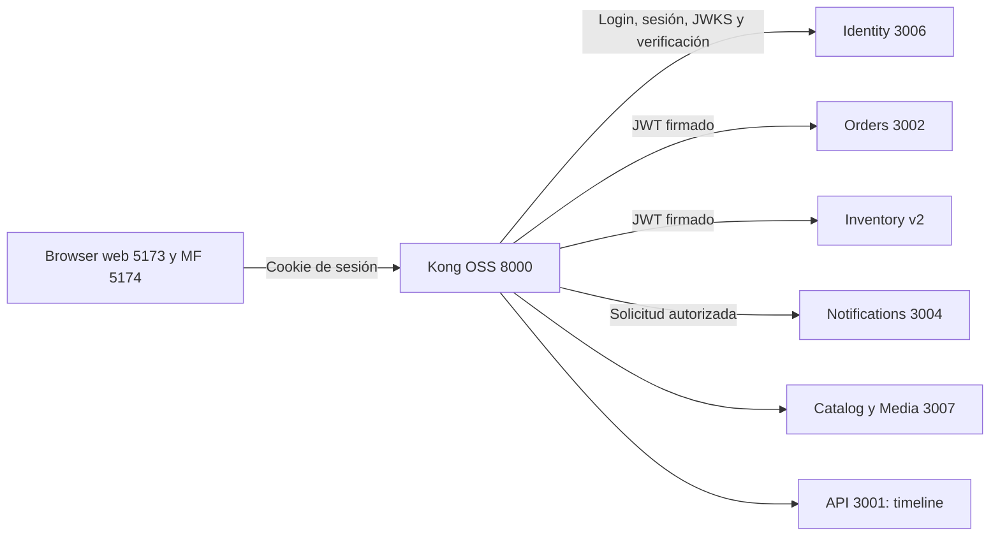

# MercadoYa

Monorepo de MercadoYa con pnpm workspaces y Turborepo. Incluye una app React con Vite y TanStack Router y una API Hono. V0 implementa productos naive; V1 separa Identity y Catalog por contrato; V2 agrega Media, Orders, Inventory, Notifications y procesamiento de pedidos por eventos. S5 (`v3-services`) extrae Orders, Inventory y Notifications, y monta el catálogo admin como MF en iframe.

## Demo V0 naive

La rama congelada para la clase es [`v0-naive`](https://github.com/rodrigop23/mercadoya-curso-asd/tree/v0-naive). Sigue el [checklist de walkthrough](docs/demo-v0.md) para levantar el demo, recorrerlo y mostrar el acoplamiento de esta versión.

## Demo V1 modular

La rama [`v1-modular`](https://github.com/rodrigop23/mercadoya-curso-asd/tree/v1-modular) conserva el refactor de Identity y Catalog con acoplamiento por contrato. Sigue el [checklist de walkthrough](docs/demo-v1.md) para levantar la versión modular y recorrer los mismos flujos.

## Demo V2 integración

La rama [`v2-integration`](https://github.com/rodrigop23/mercadoya-curso-asd/tree/v2-integration) combina el pipeline local de imágenes, módulos de dominio y pedidos con fan-out por NATS. Sigue el [guion y checklist de 50 minutos](docs/demo-v2.md) para preparar y recorrer la demo.

`docker-compose.yml` inicia infraestructura, servicios backend y Kong. El apéndice [`apps/cloud-pipeline-demo`](apps/cloud-pipeline-demo/README.md) muestra un pipeline S3→Lambda→S3 aislado; no participa en el publish de MercadoYa ni requiere credenciales AWS para `pnpm dev`.

En `v3-services`, Orders corre como proceso Node, Inventory como contenedor y Notifications usa un handler AWS Lambda. Un bridge NATS invoca ese handler directamente durante la clase local o mediante Function URL en AWS. Consulta [la guía de Notifications](apps/notifications-lambda/README.md).

El [paquete `@mercadoya/contracts`](packages/contracts/README.md) centraliza schemas HTTP/eventos y documenta ownership, generación reproducible y versionado. Specs OpenAPI: [Inventory v1/v2](apps/inventory-service/openapi.yaml), [Orders](apps/orders-service/openapi.yaml), [Identity](apps/identity-service/openapi.yaml), [Catalog](apps/catalog-service/openapi/catalog.yaml) y [Media](apps/catalog-service/openapi/media.yaml). Inventory usa [Swagger UI v2](http://localhost:3005/docs) por defecto y retiene [v1](http://localhost:3003/docs) para compatibilidad. La estrategia generate-from-code y sus límites constan en [ADR 0016](docs/adr/0016-http-event-contracts.md).

## Arquitectura y decisiones

La arquitectura actual está descrita en [ADR 0017, Identity y Kong](docs/adr/0017-identity-kong-jwks.md) y [ADR 0018, Catalog/Media](docs/adr/0018-catalog-media-kong.md). Los materiales siguientes documentan las etapas de clase.

Material para el walkthrough:

- Demos: [V0 naive](docs/demo-v0.md) en la rama [`v0-naive`](https://github.com/rodrigop23/mercadoya-curso-asd/tree/v0-naive), [V1 modular](docs/demo-v1.md) en la rama [`v1-modular`](https://github.com/rodrigop23/mercadoya-curso-asd/tree/v1-modular), [V2 integración](docs/demo-v2.md) en la rama [`v2-integration`](https://github.com/rodrigop23/mercadoya-curso-asd/tree/v2-integration) y [V3 servicios y saga](docs/demo-v3.md) en la rama [`v3-services`](https://github.com/rodrigop23/mercadoya-curso-asd/tree/v3-services).
- ADRs V0–V2: [0001 — monolito primero](docs/adr/0001-usar-monolito-primero.md), [0002 — stack React, Hono y Postgres](docs/adr/0002-elegir-stack-react-hono-postgres.md), [0003 — Identity y Catalog por contrato](docs/adr/0003-modular-identity-catalog-por-contrato.md), [0004 — pipeline local de imágenes](docs/adr/0004-media-pipeline-pipes-filters.md), [0005 — módulos service-based](docs/adr/0005-service-based-api-layer-schemas.md), [0006 — pedidos por eventos con NATS](docs/adr/0006-nats-order-placed-event-driven.md) y [0007 — demo cloud S3 aislada](docs/adr/0007-cloud-pipeline-demo-s3-aislado.md).
- ADRs S5: [0008 — versión HTTP y despliegue de Inventory](docs/adr/0008-versionado-inventory.md), [0009 — Orders como proceso](docs/adr/0009-orders-proceso-tradicional.md), [0010 — Inventory en contenedores](docs/adr/0010-inventory-contenedor.md), [0011 — Notifications Lambda y bridge](docs/adr/0011-notifications-lambda-bridge.md), [0012 — API gateway y auth](docs/adr/0012-api-gateway-auth.md), [0013 — contratos y OpenAPI Inventory](docs/adr/0013-contracts-openapi-inventory.md), [0014 — MF admin en iframe](docs/adr/0014-mf-catalog-iframe.md) y [0015 — saga por coreografía y compensación](docs/adr/0015-saga-coreografia-compensacion.md).
- C4 S5 en Mermaid: [contexto](docs/diagrams/c4-1-context.md), [contenedores](docs/diagrams/c4-2-containers-v4.md) y [componentes del API, Orders y Notifications](docs/diagrams/c4-3-components-v4.md).
- Secuencias S5: [saga de compra, compensación y email](docs/diagrams/seq-order-placed-fanout-v4.md) y [admin en MF catálogo](docs/diagrams/seq-admin-mf-catalog-v4.md). Las [vistas V2](docs/diagrams/c4-2-containers.md) y [Archify](docs/diagrams/archify/README.md) se conservan como material histórico.

## Requisitos

- Node.js `24.14.1` o superior. El scaffold se creó usando el Node ya instalado en el sistema: `v24.14.1`.
- pnpm `11.8.0`. Usa el pnpm del sistema (`/opt/homebrew/bin/pnpm`); el proyecto no instala ni cambia versiones del runtime o del package manager.

El campo `engines` documenta el mínimo de Node, `.node-version` fija la versión utilizada para este proyecto y `packageManager` documenta pnpm.

## Instalar

```sh
pnpm install --frozen-lockfile
```

## Validación local y CI

El workflow [CI](.github/workflows/ci.yml) corre en cada `push` y `pull_request`, con Node de `.node-version` y pnpm de `packageManager`. Para reproducir sus pasos desde la raíz:

```sh
pnpm install --frozen-lockfile
pnpm typecheck
pnpm lint
pnpm build
pnpm openapi:check
pnpm test
```

Turbo ejecuta los scripts de todos los workspaces que los declaran. `build` incluye `@mercadoya/contracts`, Catalog/Media, API, Orders, Inventory, Notifications, web, MF catálogo y el demo cloud. `typecheck` construye primero las dependencias de cada consumidor para resolver los exports de `contracts` desde un checkout limpio. `test` construye el paquete y sus dependencias antes de ejecutar su suite. El nuevo script raíz `test` delega en Turbo; los scripts existentes se conservan.

La suite usa `node:test` de Node 24.14.1. Los nuevos tests comprueban DTOs de Orders, Identity y Catalog, multipart, stock interno y auth/servers de las specs. `pnpm openapi:check` compara specs y schemas generados byte a byte y ejecuta Redocly; `pnpm openapi:generate` los regenera. Los tests de `contracts` importan el export público compilado y verifican los subjects NATS v1, eventos válidos, versiones, UUIDs, cantidades, fechas, causas de rechazo, override de pago y compatibilidad de las respuestas HTTP de Inventory v1/v2. Notifications conserva sus tests del handler con `fetch` simulado para envío e ingest. No se inicia ningún servidor ni se requiere Postgres, NATS, Docker, `.env`, credenciales AWS o secretos de producción. Esto no cubre persistencia, transporte NATS, browser ni el flujo completo de compra.

Para ejecutar solo una suite con sus builds previos:

```sh
pnpm exec turbo run test --filter=@mercadoya/contracts
pnpm exec turbo run test --filter=@mercadoya/notifications-lambda
# Reejecutar las suites aunque Turbo tenga resultados en cache:
pnpm test --force
```

El setup de CI usa `pnpm/setup@v3`, compatible con pnpm 11, con `cache: true` y `pnpm-lock.yaml` como clave de la cache del store. La instalación automática está desactivada para ejecutar explícitamente `pnpm install --frozen-lockfile`. No se guarda `node_modules` ni una cache remota de Turbo. El job tiene permiso `contents: read` y los PR no necesitan secretos del proyecto.

Causas de fallo y diagnóstico:

- La instalación congelada falla si los manifests y `pnpm-lock.yaml` no coinciden, falta el lockfile o cambia su compatibilidad con el major de pnpm. No quitar `--frozen-lockfile` del workflow para ocultarlo. Si cambias dependencias, actualiza el lockfile de forma deliberada con la versión declarada, revisa el diff y verifica otra vez la instalación congelada.
- `typecheck` falla ante errores de tipos, incluidos los consumidores de contratos. Si ejecutas `tsc` directamente en un consumidor desde un checkout nuevo, construye antes `contracts` o usa el comando raíz.
- `lint` conserva las reglas y severidades existentes de Oxlint; sus errores hacen fallar el paso.
- `build` falla ante errores de compilación o bundling. Compilar el demo cloud no despliega recursos ni necesita una cuenta AWS.
- `test` falla con código distinto de cero ante una aserción rota. Por ejemplo, cambiar `orderPlacedEventSchema.version` a `z.literal(2)` rompe el fixture v1 y hace fallar `pnpm test`. Turbo invalida la cache al cambiar el schema o el test; `--force` permite verificarlo sin cache.

Documentación oficial consultada para esta configuración: [pnpm CI](https://pnpm.io/continuous-integration), [inputs de pnpm/setup v3](https://github.com/pnpm/setup/tree/v3), [GitHub Actions](https://docs.github.com/en/actions/using-workflows), [sintaxis de workflows](https://docs.github.com/en/actions/reference/workflows-and-actions/workflow-syntax) y [runner node:test en Node 24.14.1](https://github.com/nodejs/node/blob/v24.14.1/doc/api/test.md).

## Demo V3: API Gateway y servicios

### Microfrontend de administración

El host React en `:5173` conserva autenticación, menú y guard de `/admin/products`. Esa ruta monta el CRUD de `apps/mf-catalog`, una app Vite independiente en `:5174`, mediante iframe. El remoto consume Catalog mediante Kong en `:8000` con cookie de sesión. [La guía del remoto](apps/mf-catalog/README.md) explica el arranque individual, los orígenes y el límite de aislamiento del iframe. Buyer + admin no son dos MF; la composición es host + pieza remota.

```text
Host web :5173 ── /admin/products ──► MF catálogo admin :5174
      │                                     │
      └──────── catálogo buyer /catalog     └──► Kong :8000 → Catalog/Media :3007
```

El navegador en `:5173` y el MF en `:5174` llaman a Kong OSS 3.9.1 en `:8000` con `credentials: include`. Kong enruta `/api/auth/*` y `/api/me` a Identity `:3006`, Orders a `:3002`, Inventory a v2 `:3003` dentro de Compose y Notifications a `:3004`. `/api/inventory/v1` conserva el despliegue v1 explícito. Catalog y Media comparten proceso en `:3007`. API `:3001` conserva solo la timeline. Kong permite ambos orígenes por CORS con credenciales.



La sesión browser persiste en Identity. El plugin oficial JWT emite tokens RS256 de cinco minutos con `kid`, `sub`, `role`, `iss`, `aud`, `iat` y `exp`. Kong usa un plugin propio que verifica la cookie o JWT con Identity y reenvía Bearer. Orders e Inventory verifican firma y claims localmente con JWKS. `iss=http://localhost:8000` y `aud=mercadoya-services` coinciden en emisor y verificadores. El plugin JWT OSS no consume JWKS remoto; OIDC requiere Enterprise. Consulta [la decisión y compatibilidad](docs/adr/0017-identity-kong-jwks.md) y [Identity](apps/identity-service/README.md).

S2S conserva secretos distintos: `CATALOG_INTERNAL_TOKEN`, `NOTIFICATIONS_INGEST_TOKEN` y `NOTIFICATIONS_INVOKE_TOKEN`. No se sustituyen por el JWT del usuario. Las rutas internas de Catalog e ingest quedan fuera de Kong; los servicios usan URLs internas de Compose. Health sigue público. La revocación de sesión invalida cookies; los JWT ya emitidos pueden durar hasta cinco minutos.

Para levantar la demo desde una copia nueva, configura `.env` a partir de `.env.example`, asigna claves aleatorias a `BETTER_AUTH_SECRET`, `CATALOG_INTERNAL_TOKEN`, `NOTIFICATIONS_INGEST_TOKEN` y `NOTIFICATIONS_INVOKE_TOKEN`, y ejecuta:

```sh
pnpm install
pnpm demo:infra
pnpm dev
```

`demo:infra` inicia Postgres y NATS, aplica las migraciones de Catalog e Identity y construye todos los servicios en Compose. En una actualización, pausa la creación de pedidos durante el cambio de consumidores y espera health antes de reanudar. `pnpm dev` inicia web y MF.

| Componente           | Puerto | Comprobación                                     |
| -------------------- | ------ | ------------------------------------------------ |
| Web                  | 5173   | `http://localhost:5173`                          |
| MF catálogo admin    | 5174   | `http://localhost:5174`                          |
| Kong OSS             | 8000   | `http://localhost:8000/api/identity/health`      |
| Catalog y Media      | 3007   | `http://localhost:8000/api/catalog/health`       |
| Timeline API         | 3001   | `http://localhost:8000/api/events/health`        |
| Identity             | 3006   | `http://localhost:8000/api/identity/health`      |
| Orders               | 3002   | `http://localhost:8000/api/orders/health`        |
| Inventory v1         | 3003   | `http://localhost:8000/api/inventory/v1/health`  |
| Inventory v2         | 3005   | `http://localhost:8000/api/inventory/v2/health`  |
| Notifications bridge | 3004   | `http://localhost:8000/api/notifications/health` |
| Postgres             | 5432   | `docker compose ps postgres`                     |
| NATS                 | 4222   | `http://localhost:8222` para monitoreo           |

| Tipo                  | Mecanismo                                                   | Quién lo usa                                                    |
| --------------------- | ----------------------------------------------------------- | --------------------------------------------------------------- |
| Sesión browser        | Cookie Better Auth, persistida y validada por Identity      | Browser mediante Kong                                           |
| JWT de aplicación     | RS256 verificado por JWKS y claims                          | Kong mediante Identity; Orders, Inventory y Catalog admin       |
| Servicio a Catalog    | `x-catalog-internal-token` y `CATALOG_INTERNAL_TOKEN`       | Inventory hacia http://catalog:3007, sin publicar stock en Kong |
| Lambda y bridge a API | `x-invoke-token` y `x-ingest-token`, con secretos distintos | Notifications                                                   |

La autenticación de usuario y los secretos entre servicios cumplen fines distintos. Esta demo no incluye service mesh. GET de pedidos y reservas requieren JWT dentro de los servicios. Kong admite también cookie browser y emite el JWT upstream. La lectura de reservas conserva el acceso de clase sin verificar la propiedad del pedido.

| Versión  | Cambio observable                                                                                                                                                                                                               |
| -------- | ------------------------------------------------------------------------------------------------------------------------------------------------------------------------------------------------------------------------------- |
| API HTTP | `/api/inventory/v1/reservations/:orderId` conserva el JSON anterior; `/v2/` exige además `reservation.status: "reserved"`.                                                                                                      |
| Servicio | Compose ejecuta `inventory-v1` e `inventory-v2` con `SERVICE_VERSION` distinto. Cada respuesta lleva `X-Service-Version`. Solo v2 consume `orders.placed` y `payment.failed`, para reservar y compensar sin consumidores en v1. |

Consulta el [guion de Inventory](apps/inventory-service/README.md) para comparar ambas respuestas con el mismo pedido y la misma cookie. La decisión está resumida en el [ADR 0008](docs/adr/0008-versionado-inventory.md).

Comprobación rápida sin sesión. Sustituye el UUID de ejemplo por uno real si quieres consultar una reserva existente:

```sh
curl -i -X POST http://localhost:8000/api/orders -H 'Content-Type: application/json' -d '{"productId":"00000000-0000-4000-8000-000000000000","quantity":1}'
curl -i http://localhost:8000/api/inventory/v2/reservations/00000000-0000-4000-8000-000000000000
curl -i http://localhost:8000/api/orders/health
curl -i http://localhost:8000/api/inventory/health
curl -i http://localhost:8000/api/inventory/v1/health
curl -i http://localhost:8000/api/inventory/v2/health
curl -i http://localhost:8000/api/notifications/health
```

Las dos primeras solicitudes responden `401` y las rutas de health responden `200`. Para comprobar el camino con sesión, inicia sesión con el cookie jar de [autenticación local](#autenticación-local), crea un producto con stock y envía el pedido con `-b /tmp/mercadoya-cookies.txt`. El `POST` responde `202` con `buyerId`; Inventory v2 consume `orders.placed`, reserva stock mediante el token interno de Catalog y publica el resultado. Consulta `/api/inventory/v2/reservations/:orderId` con el mismo cookie jar y revisa `GET /api/events` para la entrada `notification.stub` o `notification.email` del handler y su `emailStatus`. La reserva dispara el simulador; el pedido se confirma solo con `payment.succeeded`.

### Saga, compensación y correos

Orders `:3002` aloja el simulador de pago. `inventory.reserved` inicia el pago simulado y `payment.succeeded` confirma el pedido. `inventory.rejected` rechaza sin pago. `payment.failed` rechaza el pedido y dispara la liberación en Inventory v2, que restaura stock y publica `inventory.released`. El rechazo y el correo de pago fallido pueden aparecer antes de completar la liberación. Consulta [ADR 0015](docs/adr/0015-saga-coreografia-compensacion.md) y [la secuencia canónica](docs/diagrams/seq-order-placed-fanout-v4.md).

Con la demo activa y un producto dedicado con al menos dos unidades, ejecuta:

```sh
pnpm demo:saga
```

[La guía del CLI](scripts/README.md) explica los tres casos y la prueba de fallos duplicados. El CLI crea pedidos persistentes y consume una unidad en el caso exitoso. `PAYMENT_MODE=succeed` es el valor por defecto; `fail` fuerza fallos tras reiniciar Orders. El override `paymentMode` del CLI tiene prioridad y no forma parte del POST público.

Notifications escucha solo estos desenlaces y renderiza los templates con React Email:

| Subject              | Template                     | Correo                         |
| -------------------- | ---------------------------- | ------------------------------ |
| `payment.succeeded`  | `order-confirmed.tsx`        | Pedido confirmado              |
| `inventory.rejected` | `order-rejected-stock.tsx`   | No pudimos completar tu pedido |
| `payment.failed`     | `order-rejected-payment.tsx` | El pago no se completó         |

Para enviar correo configura `RESEND_API_KEY`, `RESEND_FROM`, `DEMO_NOTIFY_EMAIL` y `EMAIL_MODE=resend`, y reinicia el bridge local. Si usas Lambda, configura sus variables mediante el despliegue. Todos los pedidos usan `DEMO_NOTIFY_EMAIL`, sin lookup en Identity por `buyerId`. `EMAIL_MODE` vacío elige Resend si hay key y stub si no la hay; `EMAIL_MODE=stub` fuerza simulación. Consulta [la guía de Resend y Notifications](apps/notifications-lambda/README.md) para los requisitos del remitente y los casos de configuración incompleta.

La timeline registra `notification.stub` o `notification.email`, con `emailStatus` igual a `stub`, `sent` o `error`. `sent` significa aceptación por Resend. El envío no revierte la saga si falla; NATS Core no reproduce eventos y la timeline se pierde al reiniciar el API.

## Base de datos local

Catalog usa Drizzle ORM con el driver `node-postgres` (`pg`). Copia la configuración de ejemplo, asigna valores aleatorios a `CATALOG_INTERNAL_TOKEN`, `NOTIFICATIONS_INGEST_TOKEN` y `NOTIFICATIONS_INVOKE_TOKEN`, inicia PostgreSQL y NATS, y aplica el esquema antes de iniciar Inventory:

```sh
cp .env.example .env
pnpm demo:infra
```

`BETTER_AUTH_SECRET` debe ser una clave aleatoria de al menos 32 caracteres. Puedes generarla con `openssl rand -base64 48` y guardarla en `.env`; `BETTER_AUTH_URL` apunta a `http://localhost:8000`. Configura `EVENT_BUS=nats` y `NATS_URL=nats://localhost:4222` para Orders y el bridge de Notifications. Ambos fallan al arrancar si no pueden conectar a NATS. La API ya no consume esos eventos.

Compose inicia PostgreSQL, NATS, Identity, Catalog/Media, API, Orders, ambos despliegues Inventory, Notifications y Kong. Conserva las imágenes de Media con un bind mount de `apps/api/uploads`; `demo:infra` usa el UID/GID del host para escribirlas. `pnpm demo:infra` aplica primero la migración histórica ahora alojada en Catalog y luego la migración propia de Identity. Adopta instalaciones creadas con `db:push` sin borrar datos. Identity añade JWKS y conserva los usuarios y sesiones. Catalog conserva las migraciones históricas de las tablas compartidas, sin modificar su SQL ni el journal Drizzle. API ya no tiene tablas, módulos de dominio ni cliente HTTP Identity. No se habilitan `db:push` ni `db:generate` sobre esta base compartida. Consulta [ADR 0018](docs/adr/0018-catalog-media-kong.md).

`BETTER_AUTH_URL` y `JWT_ISSUER` usan `http://localhost:8000`. En Compose, `IDENTITY_URL=http://identity:3006` sirve para transporte interno y no modifica el issuer. Los puertos `:3006` de Identity, `:3007` de Catalog y `:3001` de API quedan ligados a loopback para diagnóstico. Kong es el borde público en `:8000`; su Admin API está desactivada.

## Desarrollo

Con los servicios backend activos en Compose, inicia web y MF:

```sh
pnpm dev
```

- Web: <http://localhost:5173>
- MF catálogo admin: <http://localhost:5174>
- Kong: <http://localhost:8000>
- Identity: <http://localhost:8000/api/identity/health>
- Catalog: <http://localhost:8000/api/catalog/health>
- Media: <http://localhost:8000/api/media/health>
- Timeline: <http://localhost:8000/api/events/health>
- JWKS: <http://localhost:8000/api/auth/jwks>
- Orders: <http://localhost:8000/api/orders/health>
- Inventory v2: <http://localhost:8000/api/inventory/v2/health>
- Notifications: <http://localhost:8000/api/notifications/health>

Para desarrollar un backend fuera de Compose, detén su contenedor y usa `pnpm --filter @mercadoya/<servicio> dev`, ajustando el upstream de Kong a `host.docker.internal`. Para apagar el laboratorio usa `docker compose down`; añadir `-v` elimina datos.

El smoke requiere una base de prueba y crea datos temporales:

```sh
set -a
. ./.env
set +a
pnpm --filter @mercadoya/identity-service smoke
```

CI ejecuta login/sesión, JWKS, CRUD con cookie y Bearer, buyer 403, uploads/full/thumb, CORS, límites, stock interno y creación/confirmación de pedido con Inventory v2. La demo saga comprueba también rechazo, compensación y eventos duplicados. Las pruebas del verificador cubren issuer/audience incorrectos, firma, expiración, algoritmo, kid y solapamiento de rotación.

## Autenticación local

Identity ofrece registro e inicio de sesión por email y contraseña en `/api/auth/*`, y `GET /api/me` devuelve la sesión actual o `401` si no hay una. El frontend debe enviar solicitudes con `credentials: 'include'` para conservar la cookie. CORS permite `http://localhost:5173` y `http://localhost:5174` con credenciales.

Después de iniciar PostgreSQL y aplicar el esquema, crea el administrador demo una vez:

```sh
pnpm dlx auth@latest create-admin --config apps/identity-service/src/auth.ts --email admin@mercadoya.local --password "$DEMO_ADMIN_PASSWORD" --name 'Admin MercadoYa' --role admin --yes
```

Define `DEMO_ADMIN_PASSWORD` fuera del repositorio antes de crear el usuario local.

Registro e inspección de sesión con `curl` y un cookie jar:

```sh
curl -i -c /tmp/mercadoya-cookies.txt \
  -H 'Origin: http://localhost:5173' \
  -H 'Content-Type: application/json' \
  -d '{"name":"Demo","email":"demo@mercadoya.local","password":"MercadoYaDemo2026!"}' \
  http://localhost:8000/api/auth/sign-up/email

curl -i -b /tmp/mercadoya-cookies.txt \
  -H 'Origin: http://localhost:5173' \
  http://localhost:8000/api/me
```

Login admin, consulta de sesión y logout con el mismo cookie jar:

```sh
curl -i -c /tmp/mercadoya-cookies.txt \
  -H 'Origin: http://localhost:5173' \
  -H 'Content-Type: application/json' \
  -d '{"email":"admin@mercadoya.local","password":"REEMPLAZAR_PASSWORD_LOCAL"}' \
  http://localhost:8000/api/auth/sign-in/email

curl -i -b /tmp/mercadoya-cookies.txt \
  -H 'Origin: http://localhost:5173' \
  http://localhost:8000/api/me

curl -i -b /tmp/mercadoya-cookies.txt -c /tmp/mercadoya-cookies.txt \
  -H 'Origin: http://localhost:5173' \
  -H 'Content-Type: application/json' \
  -d '{}' \
  http://localhost:8000/api/auth/sign-out
```

## Comandos

```sh
pnpm build      # Construye web y API
pnpm typecheck  # Revisa TypeScript en las aplicaciones
pnpm lint       # Ejecuta oxlint en los paquetes
pnpm format     # Aplica oxfmt en los paquetes y la configuración de raíz
```

## Estructura

```text
apps/
  api/             Timeline Hono :3001, sin módulos de dominio
  catalog-service/ Catalog y Media Hono + Drizzle + imágenes locales :3007
  orders-service/  Proceso Hono para pedidos y consumo NATS
  inventory-service/ Dos despliegues Hono para lectura de reservas; v2 consume NATS
  notifications-lambda/ Handler Lambda, bridge NATS y stack CDK
  mf-catalog/      MF de productos admin en iframe, Vite :5174
  web/             React + Vite + TanStack Router + TypeScript
  cloud-pipeline-demo/ CDK + Lambda, demo aislada de S3
packages/
  contracts/       Eventos NATS v1 y puertos compartidos
  tsconfig/        Configuración compartida de TypeScript
  ui/              ShadCN/Base UI y tokens compartidos por host y MF
```

La API parte del template `nodejs` de `create-hono`; la web parte del modo `router-only` de `@tanstack/cli` y conserva su estructura de rutas file-based en `apps/web/src/routes/`.

Turbo coordina `dev`, `build`, `lint`, `format` y `typecheck` a partir de los scripts de cada workspace. La web tiene una ruta inicial configurada con TanStack Router. Las tareas de desarrollo son persistentes y se ejecutan en paralelo.

Host y MF importan los componentes y CSS de [`@mercadoya/ui`](packages/ui/README.md). Esa guía documenta los exports y cómo añadir componentes con la CLI de ShadCN.

## Toolchain del sistema

Se conservan las versiones instaladas en la máquina: Node `v24.14.1` y pnpm `11.8.0`. El campo `packageManager` está fijado a `pnpm@11.8.0`; no se requiere nvm, fnm, Volta ni Corepack para instalar otra versión.

## Saga de compra por coreografía

En `v3-services`, Inventory reserva stock al recibir `orders.placed`. El pedido sigue `pending` tras `inventory.reserved`; un simulador didáctico dentro de Orders publica `payment.succeeded` para confirmarlo o `payment.failed` para rechazarlo. El fallo activa la compensación en Inventory v2, que restaura stock y publica `inventory.released`. El rechazo por stock no inicia Payment ni libera reservas. No hay orquestador ni PSP real.

Ejecuta `pnpm demo:saga` para comprobar los tres caminos y fallos duplicados. Los requisitos y efectos sobre los datos están en el [README del CLI](scripts/README.md). Notifications envía con Resend y React Email un correo por desenlace: confirmación, rechazo por stock o fallo de pago. También admite modo stub. Sigue el [checklist V3](docs/demo-v3.md) para preparar la clase y consultar los ADRs y diagramas de saga y correo.
