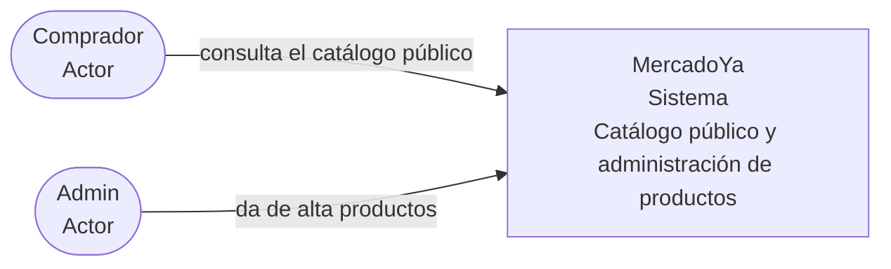

# C4 nivel 1 — System Context

MercadoYa ofrece un catálogo público y permite al administrador dar de alta productos.

No se muestran sistemas externos: el alcance actual no depende de servicios externos.
