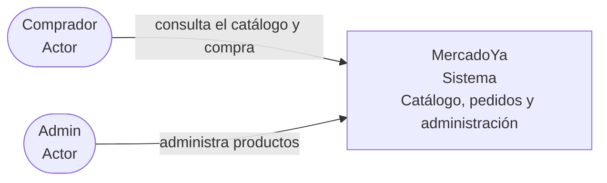

# C4 nivel 1: contexto de MercadoYa en S5 / v3-services

MercadoYa permite consultar el catálogo y crear pedidos. El admin publica productos desde la interfaz de administración.

```mermaid
flowchart LR
  buyer(["Comprador<br/>Actor"])
  admin(["Admin<br/>Actor"])
  mercadoya["MercadoYa<br/>Sistema<br/>Catálogo, pedidos y administración"]
  buyer -->|consulta el catálogo y compra| mercadoya
  admin -->|administra productos| mercadoya
```

El comprador usa el catálogo y los pedidos del host. El admin usa la ruta de productos, que monta un MF en iframe. Identity vive dentro de MercadoYa; este contexto no supone un proveedor de identidad externo. La demo S3 separada no participa en este sistema.
