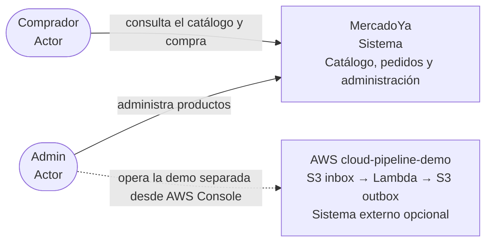

# C4 nivel 1: contexto de MercadoYa en S4

MercadoYa permite consultar el catálogo y crear pedidos. El admin publica productos desde la interfaz de administración.

```mermaid
flowchart LR
  buyer(["Comprador<br/>Actor"])
  admin(["Admin<br/>Actor"])
  mercadoya["MercadoYa<br/>Sistema<br/>Catálogo, pedidos y administración"]
  cloud["AWS cloud-pipeline-demo<br/>S3 inbox → Lambda → S3 outbox<br/>Sistema externo opcional"]

  buyer -->|consulta el catálogo y compra| mercadoya
  admin -->|administra productos| mercadoya
  admin -.->|opera la demo separada desde AWS Console| cloud
```

`cloud-pipeline-demo` es un apéndice fuera del publish de MercadoYa. La aplicación no envía imágenes a AWS.
