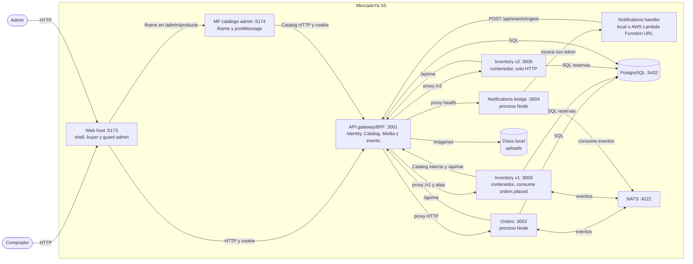

# C4 nivel 2: contenedores de MercadoYa en S5 / v3-services

Las cajas representan unidades de ejecución. `inventory-v1` e `inventory-v2` son dos despliegues de la misma imagen. El bridge corre como proceso Node y puede invocar el handler local o una Function URL.

Compose publica `3005:3003` para v2. La base es compartida en esta demo. `postMessage` solo comunica la altura del iframe al host. El handler no recibe NATS directamente.
