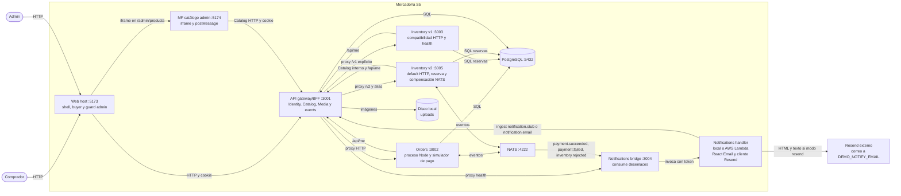

# C4 nivel 2: contenedores de MercadoYa en S5 / v3-services

Documento histórico de una etapa anterior. No describe el despliegue actual ni debe usarse para iniciarlo. Consulta el [README actual](../../README.md) y el ADR 0020 sobre el retiro de la experiencia de eventos.

Las cajas muestran las unidades de ejecución y el handler de Notifications. En local, el handler comparte el proceso del bridge. `inventory-v1` e `inventory-v2` son dos despliegues de la misma imagen. Orders incluye el simulador de pago en el mismo proceso `:3002`. El bridge corre como proceso Node y puede invocar el handler local en ese proceso o una Function URL. Resend es un proveedor externo de correo.

Compose publica `3005:3003` para v2. La base es compartida en esta demo. `postMessage` solo comunica la altura del iframe al host. El handler no recibe NATS directamente. Inventory v2 consume `orders.placed` y `payment.failed`; v1 mantiene HTTP explícito y health. El simulador consume `inventory.reserved` y publica el resultado del pago. El BFF Hono es el entrypoint; Kong queda fuera de Compose y del laboratorio. Consulta [la secuencia de saga](seq-order-placed-fanout-v3.md).
