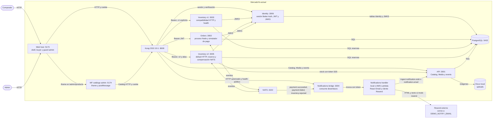

# C4 nivel 2: contenedores de MercadoYa con Identity y Kong

Las cajas muestran las unidades de ejecución y el handler de Notifications. En local, el handler comparte el proceso del bridge. `inventory-v1` e `inventory-v2` son dos despliegues de la misma imagen. Orders incluye el simulador de pago en el mismo proceso `:3002`. El bridge corre como proceso Node y puede invocar el handler local en ese proceso o una Function URL. Resend es un proveedor externo de correo.

Compose publica `3005:3003` para v2. La base es compartida en esta demo. `postMessage` solo comunica la altura del iframe al host. El handler no recibe NATS directamente. Inventory v2 consume `orders.placed` y `payment.failed`; v1 mantiene HTTP explícito y health. El simulador consume `inventory.reserved` y publica el resultado del pago. Kong es el entrypoint y todos los servicios backend corren en Compose. Consulta [la secuencia de saga](seq-order-placed-fanout-v4.md).
