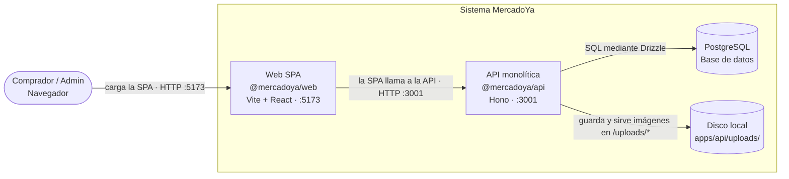

# C4 nivel 2 — Containers

Vista de ejecución de MercadoYa. En desarrollo, la SPA está en `:5173` y la API en `:3001`.

Identity y Catalog se ejecutan dentro del mismo proceso de la API. `uploads/` es almacenamiento local del monolito, no un servicio separado.
