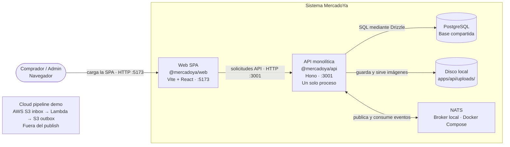

# C4 nivel 2: contenedores de MercadoYa en S4 / V2 (histórico)

Documento histórico de una etapa anterior. No describe el despliegue actual ni debe usarse para iniciarlo. Consulta el [README actual](../../README.md) y el ADR 0020 sobre el retiro de la experiencia de eventos.

Este diagrama conserva la arquitectura de la rama `v2-integration`. Para el runtime actual consulta [contenedores S5](c4-2-containers-v3.md).

Vista de ejecución de MercadoYa. La SPA corre en `:5173`; la API Hono corre en `:3001`.

```mermaid
flowchart LR
  browser(["Comprador / Admin<br/>Navegador"])

  subgraph mercadoya["Sistema MercadoYa"]
    direction LR
    web["Web SPA<br/>@mercadoya/web<br/>Vite + React · :5173"]
    api["API monolítica<br/>@mercadoya/api<br/>Hono · :3001<br/>Un solo proceso"]
    postgres[("PostgreSQL<br/>Base compartida")]
    uploads[("Disco local<br/>apps/api/uploads/")]
    nats["NATS<br/>Broker local · Docker Compose"]
  end

  cloud["Cloud pipeline demo<br/>AWS S3 inbox → Lambda → S3 outbox<br/>Fuera del publish"]

  browser -->|carga la SPA · HTTP :5173| web
  web -->|solicitudes API · HTTP :3001| api
  api -->|SQL mediante Drizzle| postgres
  api -->|guarda y sirve imágenes| uploads
  api <-->|publica y consume eventos| nats
```

Los seis módulos de dominio corren dentro del mismo proceso API. PostgreSQL y NATS se inician localmente con Docker Compose; si NATS no está disponible al inicio, la API puede usar el transporte in-process. `uploads/` guarda los archivos del pipeline local.

`cloud-pipeline-demo` es un apéndice independiente. No hay una relación de red entre la API y AWS en el flujo de publicación o compra.
