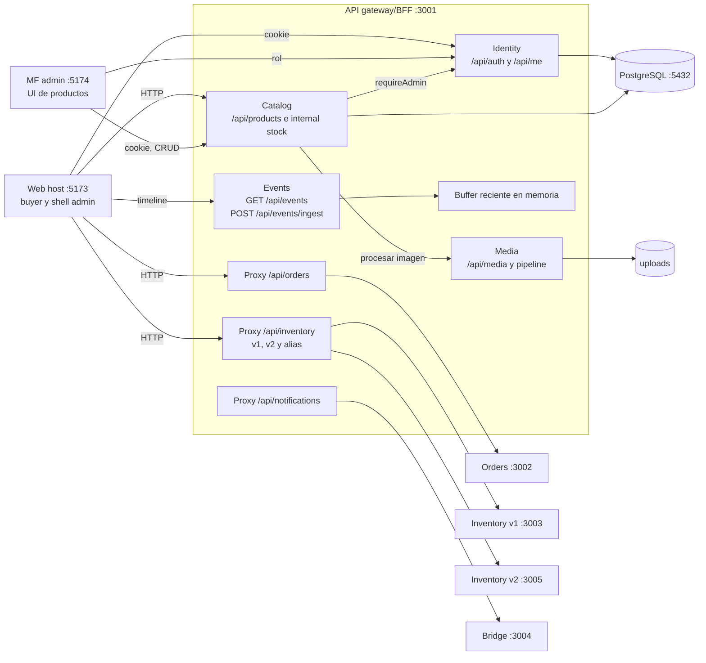

# C4 nivel 3: componentes del API en S5 / v3-services

La vista abre solo el proceso API `:3001`. Orders, Inventory, bridge y MF son procesos externos a esa caja.

Orders e Inventory consultan `GET /api/me` para validar la cookie recibida. Inventory v1 usa rutas internas de Catalog con `x-catalog-internal-token`. El handler de Notifications escribe en Events con `x-ingest-token`.
