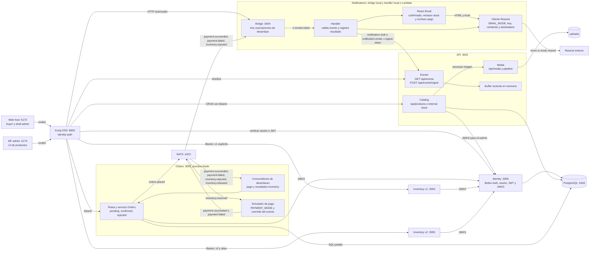

# C4 nivel 3: componentes del API, Orders y Notifications con Identity y Kong

La vista abre Identity `:3006`, API `:3001`, Orders `:3002` y Notifications, detrás de Kong `:8000`. El simulador comparte el proceso Orders. En local el bridge invoca el handler en su proceso; con Function URL, el handler corre en AWS Lambda.

Kong verifica la cookie o JWT con Identity; Orders e Inventory verifican firma y claims JWT mediante JWKS. Inventory v2 usa rutas internas de Catalog con `x-catalog-internal-token`. El handler de Notifications escribe en Events con `x-ingest-token` y `emailStatus` igual a `stub`, `sent` o `error`. Usa siempre `DEMO_NOTIFY_EMAIL`; no busca emails por `buyerId`. La compensación de Inventory y el correo por pago fallido son independientes. Consulta [ADR 0017](../adr/0017-identity-kong-jwks.md), [ADR 0015](../adr/0015-saga-coreografia-compensacion.md) y [ADR 0011](../adr/0011-notifications-lambda-bridge.md).
