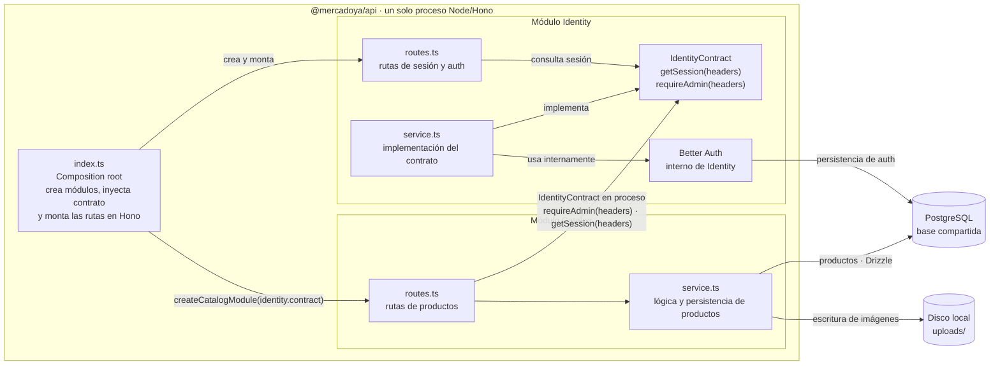

# C4 nivel 3 — Components (V1 modular)

La API compone los módulos Identity y Catalog dentro de un único proceso Node/Hono.

Las flechas entre Identity, Catalog y `index.ts` son llamadas y composición en el mismo proceso: no hay red ni despliegues separados entre módulos. PostgreSQL y `uploads/` son recursos usados por el monolito.
