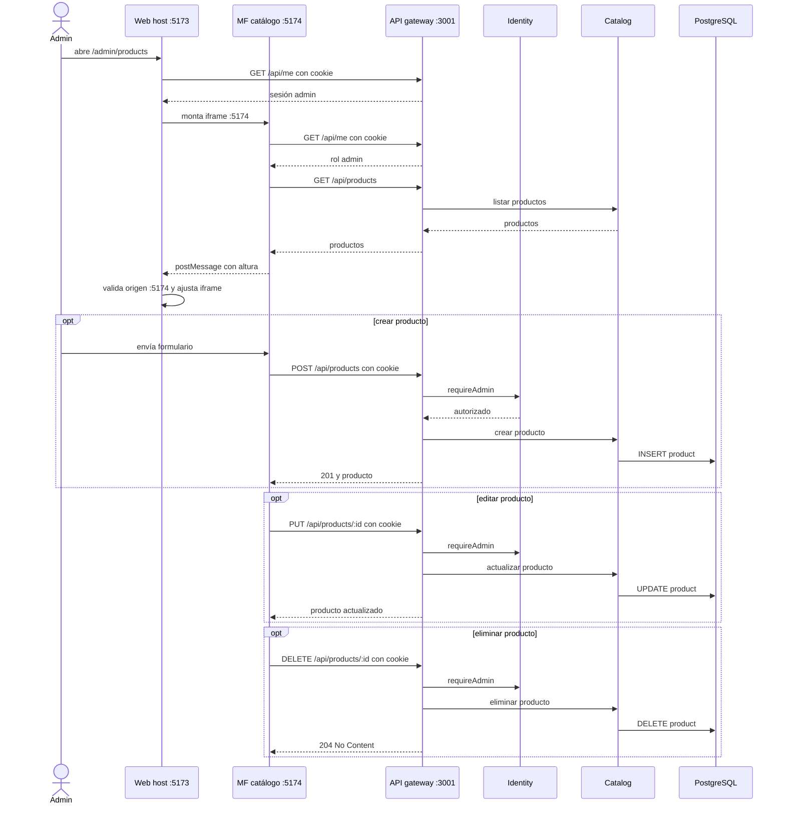

# Secuencia S5: administración de productos en el MF

El host controla la ruta y el guard; el iframe sirve el formulario y ejecuta el CRUD. El API vuelve a comprobar la autorización en cada escritura.

El catálogo buyer `/catalog` sigue en el host. La composición tiene un host y un MF admin, no un MF buyer y otro admin.
