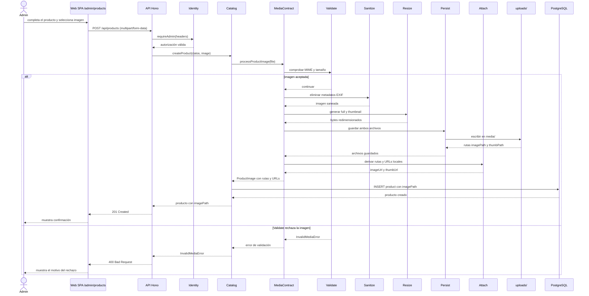

# Secuencia S4 / V2: pipeline local de imágenes (histórico)

El pipeline Media sigue en el API, pero en S5 el formulario admin vive en el [MF catálogo](seq-admin-mf-catalog.md). Esta secuencia conserva la UI de V2.

El alta de producto entra por Catalog. Catalog pide a Media procesar la imagen y conserva la ruta que devuelve el pipeline.

Media deriva `imageUrl` y `thumbUrl`, pero Catalog guarda `imagePath` en la fila de producto. El catálogo público construye la URL de la imagen completa a partir de esa ruta. El rechazo de `Validate` ocurre antes de guardar archivos.
