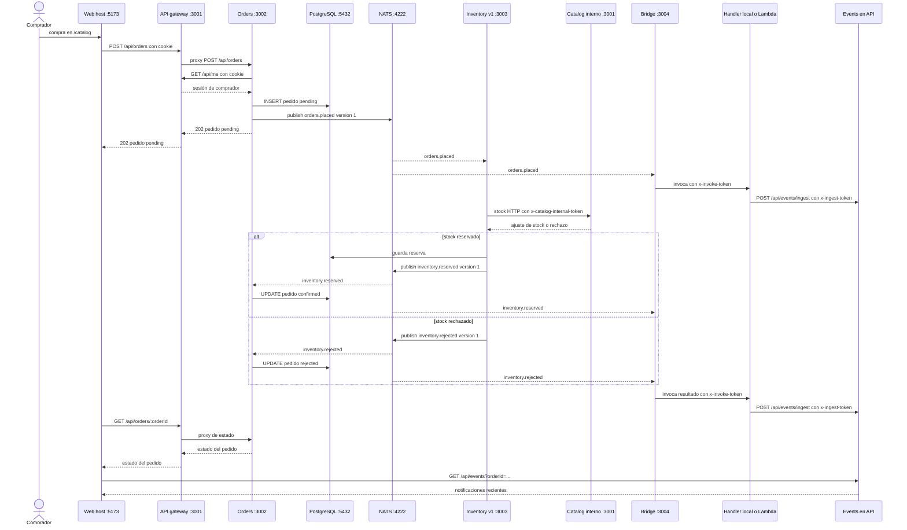

# Secuencia S5: compra con Orders, Inventory y Notifications

Solo Inventory v1 consume `orders.placed`. Inventory v2 ofrece lectura HTTP de la reserva y no vuelve a procesar el pedido.

El buffer de Events es local al API y no da persistencia de notificaciones. NATS y la actualización del pedido son asíncronos.
