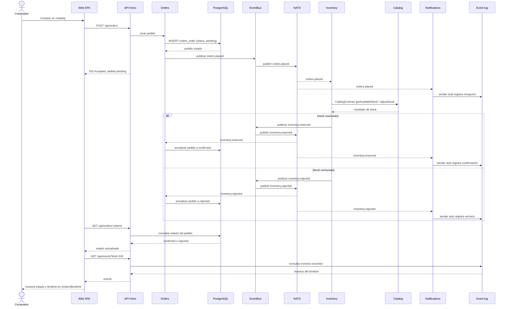

# Secuencia S4 / V2: pedido y fan-out de `orders.placed` (histórico)

Documento histórico de una etapa anterior. No describe el despliegue actual ni debe usarse para iniciarlo. Consulta el [README actual](../../README.md) y el ADR 0020 sobre el retiro de la experiencia de eventos.

Esta secuencia corresponde a `v2-integration`. El flujo distribuido actual está en [la secuencia S5](seq-order-placed-fanout-v3.md).

Orders guarda el pedido como `pending` y publica `orders.placed`. Inventory consulta el stock mediante el contrato de Catalog. Notifications registra el pedido y el resultado con un sender stub.

La vista `/events` consulta `GET /api/events`; el detalle `/orders/$orderId` consulta el estado del pedido y puede filtrar los eventos por `orderId`. La API conserva los eventos recientes en memoria. Notifications no envía correo. Catalog no se suscribe a `orders.placed`.
